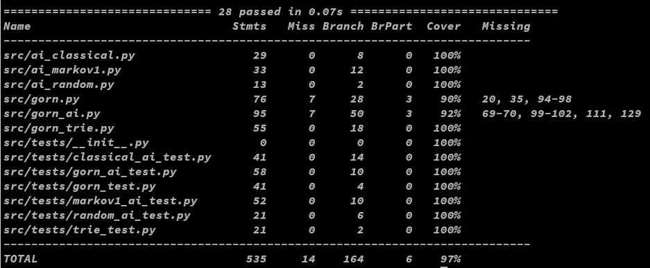
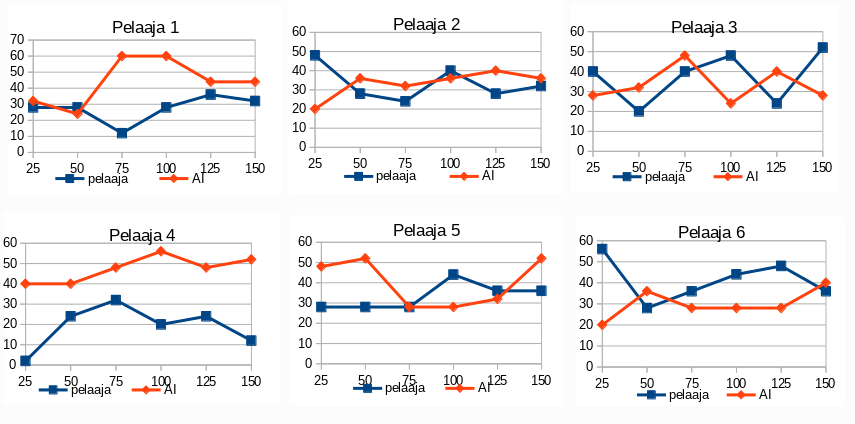
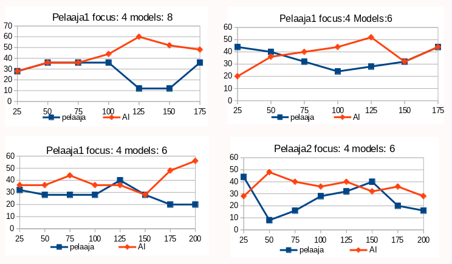

# Testausraportti

### Testaus

 Sovellusta on testattu 2 eri koneella Linuxilla(OpenSuse tumbleweed), sekä windows 10 koneella. Sovellus toimii oikein kaikilla testialustoilla, mutta poetryn asentama termcolor kirjasto ei toiminut ja se piti asentaa itse. Termcolor kirjaston toiminta vaati pienen lisäyksen käyttöliittymä-luokkaan.

### Yksikkötestaus
 Sovelluksen Yksikkötestaus on suoritettu unittestillä ja se kattaa tällä hetkellä kaiken muun paitsi käyttöliittymän. 
 
 
 
 Testikattavuudesta puuttuu kohtia, jotka eivät ole valmiina tai niille ei ole mielekästä lähteä kirjoittamaan testejä. Esimerkkinä pääohjelmasta jää pari riviä testaamatta, sillä ne sulkevat sovelluksen. 
 
 
 
 Sovellukseen on lisätty testausta varten omavaihtoehto sovelluksen sulkemisen sijaan. Sovelluksen testit ajetaan automaattisesti aina, kun githubiin tehdään muutoksia ja testiraportit ovat nähtävillä codecovissa.
 
### Koodin laatu

Koodin laatua tarkastetaan ja ylläpidetään pylintin avulla. Viimeisin pylint tarkastus antoi arvosanan 9.94/10. 

### Pelin testaus

 Sovelluksella on vasta hieman testattu siten, että tuloksia on otettu talteen. Testauksen toteutuksen määrittely ei ole vielä valmis. 
 Pelitulokset ovat jakautuneet seuraavasti:
 
* Satunnainen AI, kun pelejä pelattu 7 ja pelin keskimääräinen pituus 45 kierrosta:
    - pelaaja:   31,43%
    - Tietokone: 32,24%
    - tasapeli:  36,33% 
* Klassista todennäköisyyttä käyttävä AI, kun pelejä 7 ja keskimääräinen pituus 50 kierrosta:
    - pelaaja:   35,37%
    - Tietokone: 34,50%
    - tasapeli:  30,13%
* 1.asteen Markov, kun pelejä 3 ja keskimääräinen pituus 43 kierrosta:
    - pelaaja:   34,33%
    - Tietokone: 33,38%
    - tasapeli:  32,29%
    
 Vaihtelevan pituisia Markovin-ketjuja käyttävä AI:n suoritusta mitattu 150 erän sarjoilla:

    

 Näitä on ehkä syytä testata vielä pidemmillä peleillä. AI:n suoritumisessa on jonkin verran eroja kun focusta, eli kuinka monen kierroksen ajalta menestystä seurataan, ja mallien määrää muutetaan:

Testejä ei vielä ole montaa tehtynä pelien kierrosmääriä tulee kasvattaa vähintään 200 asti.
