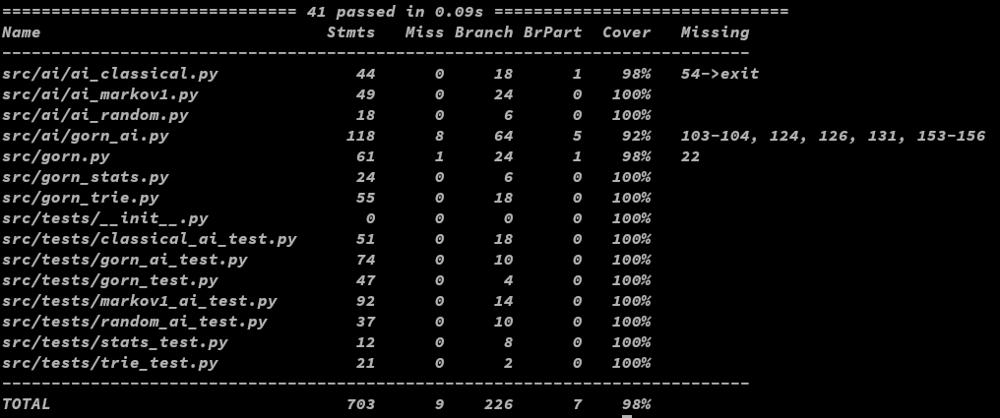
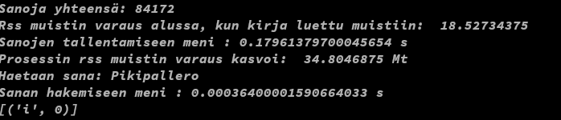

# Testausraportti

### Testaus

 Sovellusta on testattu 2 eri koneella, pääosin Linux:lla (OpenSuse tumbleweed), sekä sovelluksen toimivuutta on testattu windows 10 kannettavalla. Sovellus toimii oikein kaikilla testialustoilla, mutta poetryn asentama termcolor kirjasto ei toiminut ja se piti asentaa itse. Termcolor kirjaston toiminta windows:lla vaati myös pienen lisäyksen käyttöliittymä-luokkaan.

### Yksikkötestaus ja suorituskyky
 Sovelluksen Yksikkötestaus on suoritettu unittestillä ja se kattaa tällä hetkellä kaiken muun paitsi käyttöliittymän. Testikattavuudeksi on saatu 98%.
 
 
 
 Testikattavuudesta puuttuu kohtia, jotka eivät ole valmiina tai niille ei ole mielekästä lähteä kirjoittamaan testejä. Esimerkkinä pääohjelmasta jää pari riviä testaamatta, sillä ne sulkevat sovelluksen. 
 
 
 
 Sovellukseen on lisätty testausta varten oma vaihtoehto sovelluksen sulkemisen sijaan. Sovelluksen testit ajetaan automaattisesti aina, kun githubiin tehdään muutoksia ja testiraportit ovat nähtävillä codecovissa.

#### Suorituskyky

Sovelluksen suorituskyvyn mittaaminen on toteutettu pelaamalla peliä ja kirjaamalla tulokset talteen. AI:n suorituskyvyn mittarina onkin se, miten se pärjää pelissä ihmistä vastaan, eli kuinka suuren osan tietyn pituisista peleistä AI voittaa.

 Kuitenkin Trie tietorakenteen suorituskyky on mitattu yksinkertaisella python-skriptillä. Sovellus tallentaa Triehen Aleksis Kiven Seitsemän veljestä kirjan, joka on ladattu osoitteesta https://www.gutenberg.org/ebooks/11940. Se mittaa kuinka kauan menee tallentaa joka sana, sekä prosessin muistinvarauksen muutoksen trie-rakenteeseen tallentamisen jälkeen. Testin tulos omalla koneella (ryzen 3700x, 32gb ram, openSuse linux, kernel 5.16.10) oli seuraavanlainen:

Trie tyyppinen rakenne toimii siis melko nopeasti, mutta muistin varauksen muutos vain n. 680kt kokoisen kirjan kanssa on huomattavan suuri.
 
### Koodin laatu

Koodin laatua tarkastetaan ja ylläpidetään pylintin avulla. Viimeisin pylint tarkastus antoi arvosanan 9.93/10. Pieniä laatuvirheitä koodissa olivat liian monta atribuuttia (10/8) yms.

### Pelin testaus

 Sovelluksen suoritusta on testattu pelitesteillä, joista tulokset on kirjattu talteen. Testausta on tehty eri pelityypeillä eri pituisina sarjoina. Gorn AI:n testaus on suoritettu muista erikseen hieman eri tavoin. Sovellusta ovat testanneet eri henkilöt, vaikka pääosa peleistä on kuitenkin yhden henkilön pelaamia ja sen vuoksi kaikkia tuloksia ei ole kirjattu ylös varsinkin, kun ne ovat olleet käytännössä linjassa ylös kirjattujen tulosten kanssa. KPS moodissa testattuna pelien kierrosten voitot ovat jakautuneet seuraavasti: 

* Satunnainen AI, kun pelejä pelattu 8 ja pelin keskimääräinen pituus 46 kierrosta:
    - pelaaja:   31,98%
    - tietokone: 31,51%
    - tasapeli:  36,51% 
* Klassista todennäköisyyttä käyttävä AI, kun pelejä pelattu 8 ja keskimääräinen pituus 53 kierrosta:
    - pelaaja:   35,41%
    - tietokone: 34,83%
    - tasapeli:  29,76%
* 1.asteen Markov, kun pelejä 7 ja keskimääräinen pituus 59 kierrosta:
*    - pelaaja:   32,03%
    - tietokone: 33,36%
    - tasapeli:  34,61%

Jakaumat ovat eri pelimalleilla melko samanlaisia, mutta Markovin ketjua käyttävää AI:ta varten näin lyhyet testipelit ovat liian lyhyitä. Sen suoritus vaikuttaa parantuvan kun peli pidentyy. Toisaalta pelaaja löytää melko helposti järjestelmän, jolla pysyä johdossa. Pelitulokset muuttuvat, varsinkin tasapelien osalta, kun mukaan otetaan lisko ja Spock vaihtoehdot:

* Satunnainen AI, kun pelejä pelattu 3 ja pelin keskimääräinen pituus 75 kierrosta:
    - pelaaja:   43%
    - tietokone: 39%
    - tasapeli:  18% 
* Klassista todennäköisyyttä käyttävä AI, kun pelejä pelattu 3 ja keskimääräinen pituus 75 kierrosta:
    - pelaaja:   37%
    - tietokone: 42%
    - tasapeli:  21%
* 1.asteen Markov, kun pelejä 3 ja keskimääräinen pituus 85 kierrosta:     
*   - pelaaja:   41%
    - tietokone: 45%
    - tasapeli:  14%

Testipelejä on kuitenkin vain 3 AI-mallia kohden, joka on riittämätön kunnollisen päätelmän tekemiseen. Kuitenkin selkeä ero tasapelien vähentymisessä on havaittavissa. 
 
Testeissä satunnainen AI voitti keskimäärin hieman alle 1/3, klassinen AI hieman vajaa 40%  ja Markov1 vajaa 50% peleistä.
    
#### Tulokset Gorn AI:lla
 Vaihtelevanpituisia Markovin-ketjuja käyttävä Gorn AI:n suoritusta mitattu 150, 175 ja 200 erän sarjoilla. Peliä ei ole tilastoitu Lisko ja Spock vaihtoehdoilla. Joitain testejä on tehty ja todettu, että pelisarjojen pitää olla huomattavasti pidempiä, kuin KPS moodissa, jotta AI alkaa suoriutumaan paremmin. Kaavioissa pystyakselilla voitot prosentteina ja vaaka-akselilla pelatut erät, kun vaihdellaan 5 mallin välillä huomioiden 5 kierroksen historia:

    

 Näitä on ehkä syytä testata vielä pidemmillä peleillä. AI:n suoritumisessa on jonkin verran eroja, kun fokusta tai mallien määrää vaihdetaan, eli kuinka monen kierroksen ajalta menestystä seurataan ja kuinka pitkiä Markovin ketjuja käytetään.

Testejä on suoritettu eri malleilla ja fokuksilla. Vaikuttaisi siltä, että parhaiten AI suoriutuu kun fokus on 4 - 5 ja malleja käytössä 4 - 6. 

KPS pelatessa yli 200 kierroksen pelejä, on AI voittanut noin 60% peleistä.

